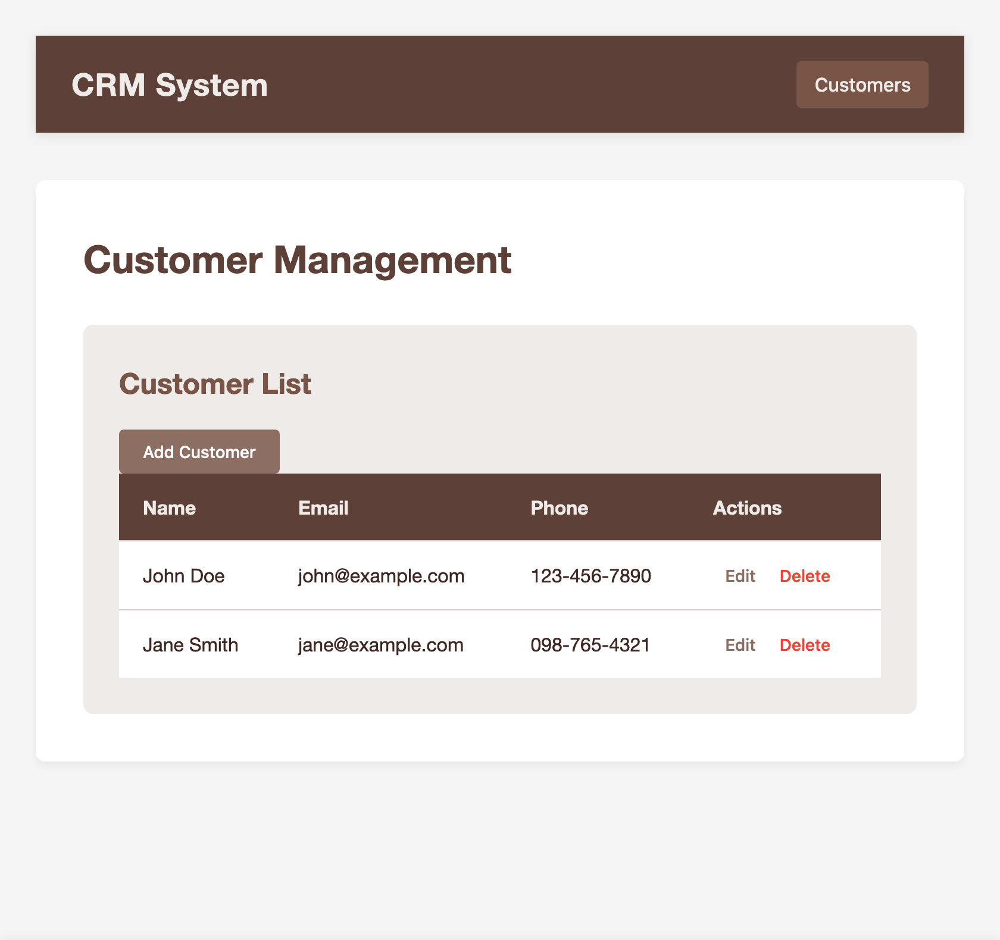

# CRM System

## Overview

This is a simple Customer Relationship Management (CRM) system built with React. It allows users to manage customer information efficiently.

## Features

- View a list of customers
- Add new customers
- Delete existing customers

## Getting Started

### Prerequisites

- Node.js (v12 or later)
- npm (v6 or later)

### Installation

1. Clone the repository:
   git clone https://github.com/yourusername/crm-system.git

2. Navigate to the project directory:
   cd crm-system

3. Install dependencies:
   npm install

4. Start the development server:
   npm start

5. Open your browser and visit http://localhost:3000

## Usage

- The main page displays a list of all customers.
- Click the "Add Customer" button to add a new customer.
- Use the "Delete" button next to each customer to remove them from the list.

## Technologies Used

- React
- CSS3
- Axios (for API calls)

## Contributing

We welcome contributions to improve the CRM system. Please fork the repository and create a pull request with your changes.

## License

This project is licensed under the MIT License. See the [LICENSE](LICENSE.md) file for details.

## Disclaimer

This CRM system is provided "as is" without any representations or warranties, express or implied. 
